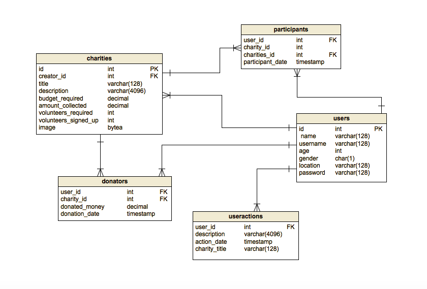

# Network for giving

#### A full-stack web application using Spring Boot 5.2 and Angular 9. 
This is a Single Page Appliaction with client-side rendering. It includes [backend](https://gitlab-talentboost.vmware.com/jignatova/final-project-talentboost/-/tree/master/network-of-giving) and [frontend](https://gitlab-talentboost.vmware.com/jignatova/final-project-talentboost/-/tree/master/network-of-giving-frontend) .
The frontend client makes API calls to the backend server when it is running.

## Screenshot

## Features
- REST API
- Base authentication
- Login / Register
- Create charity
- Donate / Participate in charity
- Delete charity you have created
- Profile page

## Technology Stacks
**Backend**
  - Java 8+
  - Spring Boot 5.2
  - Spring Security
  - Basic Authentication
  - Spring Data JDBC
  - PostgreSQL
  - Maven

**Frontend**
  - Angular: 9
  - Angular CLI: 9
  - Clarity

## Database Schema

## How to  Run

Start the backend server before the frontend client.  

**Backend**

  1. Install [PostgreSQL](https://www.postgresql.org/download/) 
  2. Configure datasource in `application.properties`.
  3. `cd network-of-giving`.
  4. Run `mvn install`.
  5. Run `mvn spring-boot:run`.
  6. The backend server is running on [localhost:8080]().

**Frontend**
  1. Install [Node.js and npm](https://www.npmjs.com/get-npm)
  2. `cd network-of-giving-frontend`.
  3. Run `npm install`.
  4. Run `ng serve`
  5. The frontend client is running on [localhost:4200]().
  
Note: The backend API url is configured in `src/environments/environment.ts` of the frontend project. It is `localhost:8080/api/v1` by default.
  

